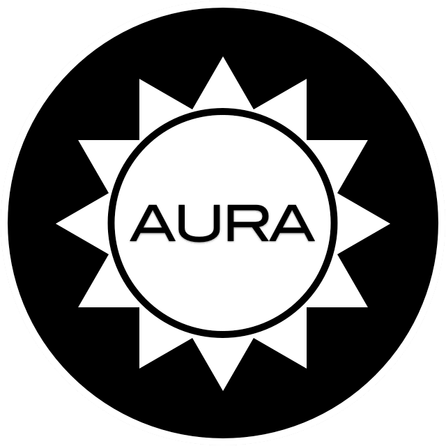

<!-- Main hero unit for a primary marketing message or call to action -->

    <h1>The Aura Project for PHP</h1>
    
    

        If you like <strong>clean</strong> code, <strong>fully
        decoupled</strong> libraries, and truly
        <strong>independent packages</strong>, then the Aura
        project is for you. Download a single package and start
        using it in your project today, with <strong>no added
        dependencies</strong>.
    

    
<a class="btn btn-primary btn-large">Learn more &raquo;</a>

<!-- Example row of columns -->

    

        <h2>Heading</h2>
        
Donec id elit non mi porta gravida at eget metus. Fusce dapibus, tellus ac cursus commodo, tortor mauris condimentum nibh, ut fermentum massa justo sit amet risus. Etiam porta sem malesuada magna mollis euismod. Donec sed odio dui. 

        
<a class="btn" href="#">View details &raquo;</a>

    

    

        <h2>Heading</h2>
        
Donec id elit non mi porta gravida at eget metus. Fusce dapibus, tellus ac cursus commodo, tortor mauris condimentum nibh, ut fermentum massa justo sit amet risus. Etiam porta sem malesuada magna mollis euismod. Donec sed odio dui. 

        
<a class="btn" href="#">View details &raquo;</a>

   

    

        <h2>Heading</h2>
        
Donec sed odio dui. Cras justo odio, dapibus ac facilisis in, egestas eget quam. Vestibulum id ligula porta felis euismod semper. Fusce dapibus, tellus ac cursus commodo, tortor mauris condimentum nibh, ut fermentum massa justo sit amet risus.

        
<a class="btn" href="#">View details &raquo;</a>

    

